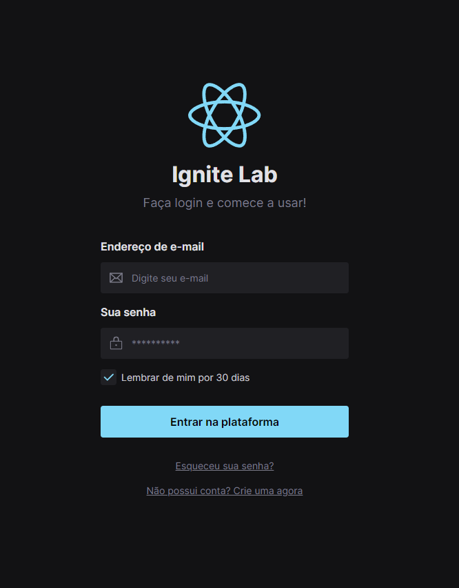

# Ignite Lab Design System

<div align="center">
 
</div>

<br><br>

## ✨💡 Functionalities

---

<br>

This project was created in Figma then it was created with React and Storybook. After finishing the project, it was deployed to the github actions workflow

Storybook was used to document the components, pages, tests and making mocks of the api integrations.

<br>

It was created in the Ignite Lab with [Rocketseat](https://www.rocketseat.com.br/) 💜

<br>

### Access Figma layout [Here!](https://www.figma.com/file/5sWPgjv9nWELANdqJhD3EQ/Ignite-Lab?node-id=0%3A1)

### Access Storybook DS [Here!](https://gabynk.github.io/lab-design-system)

<br>

## 🛠️ Tecnology

---

<br>

- [Figma](https://storybook.js.org/)
- [Storybook](https://storybook.js.org/)
- [MSW Storybook Addon](https://github.com/mswjs/msw-storybook-addon)
- [React](https://pt-br.reactjs.org/)
- [Typescript](https://www.typescriptlang.org/)
- [Tailwindcss](https://tailwindcss.com/)
- [Vite](https://vitejs.dev/)

<br>

## 🎲 Getting started

---

<br>

```bash
# project
npm install
npm run dev

# storybook
npm run storybook

# test with storybook
npm run test-storybook
```

<br>

<p align="center">Developed with 💜 by Gabriele Nakassima </p>
